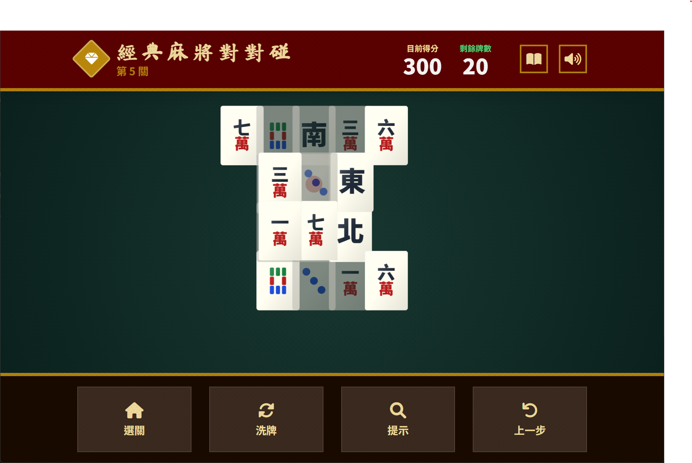

# 🀄 麻將對對碰 - 長輩友善特大字版

這是一款專為長輩設計的「麻將對對碰（Mahjong Solitaire）」遊戲。考量到老年用戶的需求，我們在視覺設計、互動操作以及聽覺回饋上進行了深度優化，提供流暢且無負擔的益智體驗。

🎉 **試玩看看吧**
立即體驗這款趣味十足的婚禮互動遊戲！👉 [立即試玩](https://tony8382.github.io/mahjong-match/)  

## 🌟 遊戲特色

### 1. 長輩友善設計 (Senior-Friendly)
- **特大字體與圖示**：採用極大化的麻將牌面，確保視力較弱的用戶也能輕鬆辨識「萬、筒、條、風、箭」。
- **高對比度色彩**：嚴選高對比色調（如正紅、深綠、藏青），降低色彩混淆的可能性。
- **直覺操作**：大面積的點擊區域與明確的按鈕標記，減少誤觸機率。

### 2. 多重感官回饋
- **觸覺反饋 (Haptic Feedback)**：配對成功、失敗或點擊時，手機會發出不同強度的震動，提供真實的觸碰感。
- **五聲旋律背景音樂**：採用柔和的古箏音色（宮商角徵羽五聲調式），營造放鬆、安寧的遊戲氛圍。
- **沈浸式音效**：清脆的麻將碰撞聲，增強遊戲的物理實體感。

### 3. 無限闖關系統
- **動態難度調整**：從第 1 關開始，隨著關卡增加，牌數、層數和複雜度逐漸提升。
- **進度自動保存**：使用 localStorage 自動記錄已解鎖的最高關卡和累計總分。
- **關卡選擇自由**：可以選擇從任何已解鎖的關卡開始挑戰。
- **無上限回一步 (Undo)**：允許用戶隨時撤銷操作，減輕心理壓力。
- **智慧提示與自動洗牌**：當找不到解法時，提示功能與洗牌功能確保遊戲不中斷。

## 🛠 技術規格

- **前端框架**：React 19 (ES Modules)
- **樣式處理**：Tailwind CSS (響應式設計，適配各型號手機與平板)
- **動畫效果**：CSS 3D Transforms (實現牌面翻轉與消失特效)
- **音訊引擎**：Web Audio API (動態合成 BGM 與音效，無需加載大型音頻文件)
- **圖示庫**：Font Awesome 6

## 🎮 玩法說明

1. **配對消消樂**：點擊兩張圖案完全相同的麻將牌，即可將其消除。
2. **點選規則**：
   - 牌的上方不能有其他牌壓著。
   - 牌的左右兩側至少有一邊是空的。
3. **過關目標**：將桌面上所有的麻將牌全部消除。
4. **輔助工具**：
   - **提示**：點擊魔法棒圖示，會發光顯示一組可消除的對子。
   - **洗牌**：將剩下的牌重新隨機排列（保證一定有解）。

## 📱 安裝與運行

本專案採用現代前端開發模式，您可以直接在支援 ES6 Module 的瀏覽器中運行。

1. 確保目錄中包含 `index.html`, `index.tsx`, `App.tsx` 等文件。
2. 使用本地伺服器（如 `live-server` 或 `python -m http.server`）開啟。
3. 由於包含震動與音訊功能，建議在行動裝置瀏覽器上獲得最佳體驗。

## 🎨 UI/UX 優化細節

- **移除點擊陰影**：針對行動裝置優化，移除了預設的點擊灰色高亮，改以平滑的邊框陰影變化來增加視覺穩定性。
- **緩慢動畫**：消牌動畫時間設定為 1.2 秒，讓長輩能看清牌面消失的路徑，避免畫面變化太快產生困惑。
- **無廣告干擾**：全螢幕純淨體驗，讓長輩能專注於邏輯思考。

---
*「動動腦，防失智。希望這款遊戲能帶給家中的長輩快樂與健康！」*
